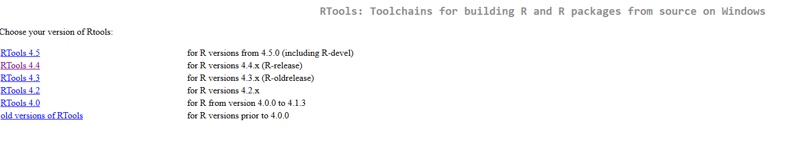
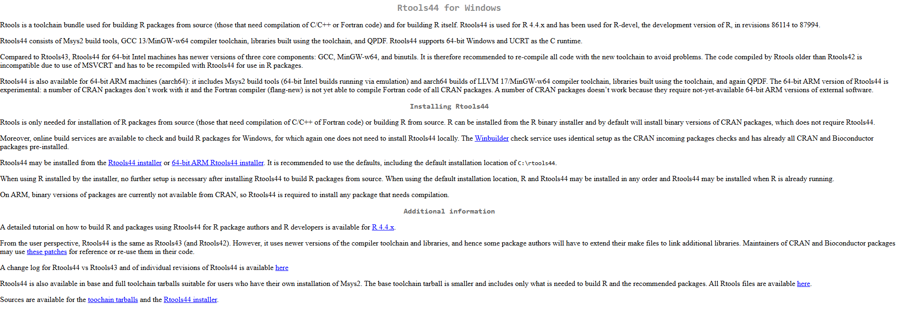

Mechanistic physiological niche modeling based on microclimate simulations

`micronicheR` is an R package for mechanistic physiological niche modeling based on microclimate simulations generated with the `NicheMapR` package. The current release provides complete workflows for mechanistic physiological niche modeling of both endotherms (`endonicheR()`) and ectotherms (`ectonicheR()`). The package is designed as a modular framework in which different physiological models share the same microclimate workflow.

The package was designed to provide:

- reuse the same microclimate simulation across species, substantially reducing computational time in multispecies analyses;
- run microclimate simulations only once per pixel;
- reuse microclimate outputs across multiple species;
- integrate environmental rasters and physiological traits;
- support large-scale spatial simulations;
- save intermediate results through an optional checkpoint system for long simulations;
- resume interrupted simulations without recomputing completed blocks.

## Contents

- Main functions
- Pre-installation requirements
- Installation
- Getting started
- Example datasets
- Endotherm simulations
- Ectotherm simulations
- Output formats
- Checkpoint system
- Authors

## Main functions

| Function       | Purpose                                | Status               |
| -------------- | -------------------------------------- | -------------------- |
| `endonicheR()` | Endotherm physiological niche modeling | ✅ Available         |
| `ectonicheR()` | Ectotherm physiological niche modeling | ✅ Available         |

### Physiological workflows

| Function       | Physiological model                    | Target organisms     |
| -------------- | -------------------------------------- | -------------------- |
| `endonicheR()` | endoR()                                | Endotherms           |
| `ectonicheR()` | ectotherm()                            | Ectotherms           |

## Pre-installation requirements

The `micronicheR` package works correctly with `R version 4.4.3`, which can be downloaded from the following link: 
[Download R version 4.4.3](https://cran.r-project.org/bin/windows/base/old/4.4.3/R-4.4.3-win.exe)

After downloading it, change the current R version in your RStudio, as shown in the figure below:


## Install `micronicheR`

If a previous version of `micronicheR` is already installed, detach and remove it first:

```{r eval=FALSE}

try(detach("package:micronicheR", unload = TRUE), silent = TRUE)

remove.packages("micronicheR")

```

Then install the latest GitHub version:

```{r eval=FALSE}

install.packages("remotes")

options(timeout = 600)

remotes::install_github(
    "jrz-s/micronicheR"
  , dependencies = TRUE
  , upgrade = "never"
  , method = "libcurl"
)

```

## Load packages

```{r eval=FALSE, message=FALSE, warning=FALSE}

library(micronicheR)

```

## Install `NicheMapR`

The helper function below installs the GitHub version of `NicheMapR`, which is required by `micronicheR`.

```{r eval=FALSE}

micronicheR::microniche_setup(github = "mrke/NicheMapR")

```

⚠️ **Note for Windows users**

On some Windows systems, installing `NicheMapR` may require `Rtools44` because the package contains compiled `Fortran` code.

If you see errors related to:

- `gfortran`
- `Rtools`
- `compilation failed`
- `make: gfortran: No such file or directory`

Install `Rtools44` from:

[install Rtools44](https://cran.r-project.org/bin/windows/Rtools/)

After clicking the link, follow the steps below:

**Step 01**



**Step 02**



After installing `Rtools44`, restart RStudio and run the installation again.

```{r eval=FALSE}

.rs.restartR()

```

## Download and Install Global Climate Database

Run the following command once before using `endonicheR()` or `ectonicheR()`:

```{r eval=FALSE}

micronicheR::microniche_setup_global_climate(folder = getwd())

```

**Important:** Restart session in R!

```{r eval=FALSE}

.rs.restartR()

```

## 🚀 Getting started

### Load packages

```{r eval=FALSE, message=FALSE, warning=FALSE}

library(micronicheR)
library(terra)

```

### Example datasets

The package includes example rasters, coordinates, and species trait datasets that can be used to reproduce the examples below.

```{r}

list.files(
  system.file("extdata", package = "micronicheR"))

```

The following six files should appear:

- `coord_example.csv`<br>
- `cover_example.tif`<br>
- `elevation_example.tif`<br>
- `study_example.tif`<br>
- `traits_endonicheR_example.csv`<br>
- `traits_ectonicheR_example.csv`

#### Load example rasters

```{r eval=FALSE}

cover <- terra::rast(
  system.file(
      "extdata"
    , "cover_example.tif"
    , package = "micronicheR"
  )
)

elev <- terra::rast(
  system.file(
      "extdata"
    , "elevation_example.tif"
    , package = "micronicheR"
  )
)

study <- terra::rast(
  system.file(
      "extdata"
    , "study_example.tif"
    , package = "micronicheR"
  )
)

```

### Load example traits

**Endotherm traits**

```{r eval=FALSE}

traits <- utils::read.csv(
  system.file(
      "extdata"
    , "traits_endonicheR_example.csv"
    , package = "micronicheR"
  )
)

head(traits)

```

**Ectotherm traits**

```{r eval=FALSE}

traits <- utils::read.csv(
  system.file(
      "extdata"
    , "traits_ectonicheR_example.csv"
    , package = "micronicheR"
  )
)

head(traits)

```

### Load coordinates

```{r eval=FALSE}

coords <- utils::read.csv(
  system.file(
      "extdata"
    , "coord_example.csv"
    , package = "micronicheR"
  )
  , row.names = 1
)

head(coords)

```

## Convert rasters to data frame

```{r eval=FALSE}

df <- micronicheR::rast_to_df(
    rcover = cover
  , rtop = elev
  , rast_or_coord = study
  , return = "data"
)

head(df)

```

## Endotherm physiological niche modeling: `endonicheR()`

## Run `endonicheR()` using a study raster

```{r eval=FALSE}

out_df_toraster <- micronicheR::endonicheR(
    rcover = cover
  , rtop = elev
  , rast_or_coord = study
  , traits_df = traits
  , sample_n = 2
  , list_format = FALSE
)

head(out_df_toraster)

```

## Run `endonicheR()` using coordinates

```{r eval=FALSE}

out_df_tocoord <- micronicheR::endonicheR(
    rcover = cover
  , rtop = elev
  , rast_or_coord = coords
  , traits_df = traits
  , sample_n = 2
  , list_format = FALSE
)

head(out_df_tocoord)

```

## Ectotherm physiological niche modeling: `ectonicheR()`

## Run `ectonicheR()` using a study raster

```{r eval=FALSE}

out_df_toraster <- micronicheR::ectonicheR(
    rcover = cover
  , rtop = elev
  , rast_or_coord = study
  , traits_df = traits
  , sample_n = 2
  , list_format = FALSE
)

head(out_df_toraster)

```

## Run `ectonicheR()` using coordinates

```{r eval=FALSE}

out_df_tocoord <- micronicheR::ectonicheR(
    rcover = cover
  , rtop = elev
  , rast_or_coord = coords
  , traits_df = traits
  , sample_n = 2
  , list_format = FALSE
)

head(out_df_tocoord)

```

## Output formats

The `endonicheR()` and `ectonicheR()` functions support the same three output formats. For simplicity, the examples below use `endonicheR()` only.

### 1. List 

```{r eval=FALSE}

out_list <- micronicheR::endonicheR(
    rcover = cover
  , rtop = elev
  , rast_or_coord = study
  , traits_df = traits
  , sample_n = 2
  , list_format = TRUE
)

str(out_list, max.level = 3)

```

Returns a hierarchical list containing:

- species
  - energy (energy balance)
  - evap (evaporative water loss)

### 2. Data frame

See the examples above.

```{r eval=FALSE}
list_format = FALSE
```

Returns a tidy data frame.

### 3. Summary statistics

```{r eval=FALSE}
summary = TRUE
```

```{r eval=FALSE}

out_summary <- micronicheR::endonicheR(
    rcover = cover
  , rtop = elev
  , rast_or_coord = coords
  , traits_df = traits
  , sample_n = 2
  , list_format = FALSE
  , summary = TRUE
    
)

head(out_summary)
```

Returns daily summaries by species and pixel.

## Long simulations and checkpoint recovery 

Both `endonicheR()` and `ectonicheR()` support large simulations through the break_n argument. The examples below use `endonicheR()`, but the same workflow applies to `ectonicheR()` because both functions share the same checkpoint system and arguments.

### `break_n` argument

Divides the study area into blocks of pixels.

```{r eval=FALSE}
out_break <- micronicheR::endonicheR(
    rcover = cover
  , rtop = elev
  , rast_or_coord = study
  , traits_df = traits
  , break_n = 100)

head(out_break)

```

In this example, pixels are processed in blocks of 100 locations.

### `checkpoint_dir` argument

Defines a directory where intermediate results are stored.

For `endonicheR()`, the checkpoint directory has the following structure:

```
checkpoint_run/

    endonicheR/

        micro_global/

        endotherm/
```

For `ectonicheR()`, the checkpoint directory has the following structure:

```
checkpoint_run/

    ectonicheR/

        micro_global/

        ectotherm/
```


```{r eval=FALSE}

out_break_stored <- micronicheR::endonicheR( 
    rcover = cover 
  , rtop = elev 
  , rast_or_coord = study 
  , traits_df = traits 
  , break_n = 100 
  , checkpoint_dir = "checkpoint_run" )

head(out_break_stored)

```

For each processed block, `endonicheR()` stores independent checkpoints for:

- microclimate simulations generated by `micro_global()`;
- physiological simulations generated by `endoR()`.

These checkpoints allow previously completed stages to be reused without recomputation, substantially reducing execution time when simulations are resumed after an interruption.

### `resume` argument

Determines whether previously saved checkpoints should be reused.

```{r eval=FALSE}

out_break_stored_resume <- micronicheR::endonicheR(
    rcover = cover
  , rtop = elev
  , rast_or_coord = study
  , traits_df = traits
  , break_n = 100
  , checkpoint_dir = "checkpoint_run"
  , resume = TRUE )

head(out_break_stored_resume)

```

When `resume = TRUE`, previously completed blocks are loaded automatically and are not recalculated.

This allows interrupted simulations to continue from the last completed block instead of restarting from the beginning.

**Example workflow**

```{r eval=FALSE}

out_apply <- micronicheR::endonicheR(
    rcover = cover
  , rtop = elev
  , rast_or_coord = study
  , traits_df = traits
  , break_n = 100
  , checkpoint_dir = "checkpoint_run")

head(out_apply)

```

If the simulation is interrupted, simply run the same command again:

```{r eval=FALSE}

out_apply <- micronicheR::endonicheR(
    rcover = cover
  , rtop = elev
  , rast_or_coord = study
  , traits_df = traits
  , break_n = 100
  , checkpoint_dir = "checkpoint_run"
  , resume = TRUE)

head(out_apply)

```

Previously completed blocks will be reused automatically.

## Remove checkpoint files

Checkpoint files can occupy considerable disk space in large simulations.

If checkpoint files are no longer needed, they can be removed using:

```{r eval=FALSE}
micronicheR::checkpoint_remove(
  checkpoint_dir = "checkpoint_run")

```

This permanently removes all checkpoint files generated during previous simulations.

## Disclaimer

micronicheR is under active development. Although the package has been extensively tested, interfaces and functionality may change in future releases. Users are encouraged to report bugs and suggestions through the GitHub repository.

## Author(s)

Zárate-Salazar, J. Rafael, PhD<br>
Postdoctoral Researcher<br>
Graduate Program in Ecology and Conservation<br>
Federal University of Sergipe (UFS), São Cristóvão, Sergipe, Brazil<br>

Valença, Saulo E. S., MSc<br>
Doctoral Researcher<br>
Graduate Program in Ecology and Conservation<br>
Federal University of Sergipe (UFS), São Cristóvão, Sergipe, Brazil

Senzano Castro, Luis Miguel, PhD<br> 
Postdoctoral Researcher<br>
São Paulo State University (UNESP), São Paulo, Brazil

Rubalcaba, Juan G., PhD<br> 
Ramón Y Cajal Researcher<br> 
Pyrenean Institute of Ecology, Huesca, Spain

Oliveira, Eduardo Vinícius da Silva, PhD<br>
Professor, Department of Ecology<br>
Federal University of Sergipe, São Cristóvão, Sergipe, Brazil

Gouveia, Sidney Feitosa, PhD<br>
Professor, Department of Ecology<br>
Federal University of Sergipe, São Cristóvão, Sergipe, Brazil
