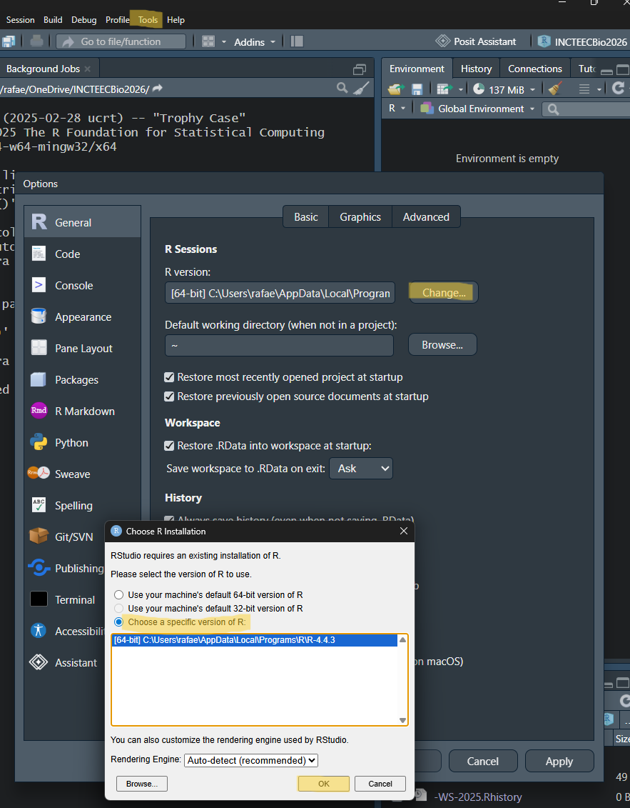

`micronicheR` is an R package for microclimate-based physiological niche modeling using environmental rasters, species traits, and `NicheMapR`.

The package was designed to:

- run microclimate simulations only once per pixel;
- reuse microclimate outputs across multiple species;
- integrate environmental rasters and physiological traits;
- support large-scale spatial simulations.

## Pre-instalation

The `micronicheR` package works correctly with `R version 4.4.3`, which can be downloaded from the following link: 
[Download R version 4.4.3](https://cran.r-project.org/bin/windows/base/old/4.4.3/R-4.4.3-win.exe)

After downloading it, change the current R version in your RStudio, as shown in the figure below:



## Installation

```{r eval=FALSE}
install.packages("remotes")

remotes::install_github("jrz-s/micronicheR")
```

## Install dependencies

```{r eval=FALSE}
microniche_setup(
  cran = c(
    "terra",
    "dplyr",
    "tidyr",
    "tibble",
    "purrr",
    "here"
  ),
  github = "mrke/NicheMapR"
)

```

## Install Global Climate from NicheMap

After the global climate data download is complete, `restart R` before running `microniche()` function.

```{r eval=FALSE}

microniche_setup_global_climate(folder = getwd())

```

## Load package

```{r message=FALSE, warning=FALSE}
library(micronicheR)
library(terra)
```

## Example datasets

The package contains example rasters, coordinates, and species traits. Check the sample data from the package `microniche`.

```{r}
list.files(
  system.file("extdata", package = "micronicheR"))
```

The following five files should appear:

- "coord_example.csv"<br>
- "cover_example.tif"<br>
- "elevation_example.tif"<br>
- "study_example.tif"<br>
- "traits_example.csv"<br>

### Load example rasters

```{r eval=FALSE}
cover <- terra::rast(
  system.file(
    "extdata",
    "cover_example.tif",
    package = "micronicheR"
  )
)

elev <- terra::rast(
  system.file(
    "extdata",
    "elevation_example.tif",
    package = "micronicheR"
  )
)

study <- terra::rast(
  system.file(
    "extdata",
    "study_example.tif",
    package = "micronicheR"
  )
)
```

### Load species traits

```{r eval=FALSE}
traits <- read.csv(
  system.file(
    "extdata",
    "traits_example.csv",
    package = "micronicheR"
  )
)

head(traits)
```

### Load coordinates

```{r eval=FALSE}
coords <- read.csv(
  system.file(
    "extdata",
    "coord_example.csv",
    package = "micronicheR"
  )
)

head(coords)
```

## Convert rasters to data frame

```{r eval=FALSE}
df <- rast_to_df(
  rcover = cover,
  rtop = elev,
  rast_or_coord = study,
  return = "data"
)

head(df)
```

## Run microniche model using study raster

```{r eval=FALSE}

out_df_toraster <- microniche(
    rcover = cover
  , rtop = elev
  , rast_or_coord = study
  , traits_df = traits
  , sample_n = 2
  , list_format = FALSE
)

head(out_df_toraster)
```

## Run microniche model using coordinates

```{r eval=FALSE}

out_df_tocoord <- microniche(
    rcover = cover
  , rtop = elev
  , rast_or_coord = coords
  , traits_df = traits
  , sample_n = 2
  , list_format = FALSE
)

head(out_df_tocoord)
```

## Other Outputs 

The package supports three output modes.

### 1. List 

```{r eval=FALSE}
out_list <- microniche(
  rcover = cover,
  rtop = elev,
  rast_or_coord = study,
  traits_df = traits,
  sample_n = 2,
  list_format = TRUE,
)

str(out_list, max.level = 3)

```

Returns hierarchical outputs:

- species
  - energy
  - evaporation
  - pixels

### 2. Data frame

`See` "Run microniche model using study raster" and "Run microniche model using coordinates"

```{r eval=FALSE}
list_format = FALSE
```

Returns tidy tabular output.

### 3. Summary statistics

```{r eval=FALSE}
summary = TRUE
```

```{r eval=FALSE}

out_summary <- microniche(
    rcover = cover
  , rtop = elev
  , rast_or_coord = coords
  , traits_df = traits
  , sample_n = 2
  , list_format = FALSE
  , summary = TRUE
    
)

head(out_summary)
```

Returns daily summaries by species and pixel.

## Disclaimer

`micronicheR` is currently under active development and should be considered experimental software. Functions, arguments, outputs, and workflows may change in future versions.

Some functions rely on external resources from `NicheMapR`, especially the global climate database required by `NicheMapR::micro_global()`. Downloading these data may require a stable internet connection and can occasionally fail due to timeout, interrupted downloads, GitHub availability, or local permission issues.

Before running `microniche()` for the first time, users should download and register the required global climate data:

```r
microniche_setup_global_climate(folder = getwd())
```
## Author(s)

Zárate-Salazar, J. Rafael, PhD<br>
Postdoctoral Researcher<br>
Graduate Program in Ecology and Conservation<br>
Federal University of Sergipe (UFS), São Cristóvão, Sergipe, Brazil<br>

Valença, Saulo E. S., MSc<br>
Doctoral Researcher<br>
Graduate Program in Ecology and Conservation<br>
Federal University of Sergipe (UFS), São Cristóvão, Sergipe, Brazil

Senzano Castro, Luis Miguel, PhD<br> 
Postdoctoral Researcher<br>
São Paulo State University (UNESP), São Paulo, Brazil

Rubalcaba, Juan G., PhD<br> 
Ramón Y Cajal Researcher<br> 
Pyrenean Institute of Ecology, Huesca, Spain

Gouveia, Sidney Feitosa, PhD<br>
Professor, Department of Ecology<br>
Federal University of Sergipe, São Cristóvão, Sergipe, Brazil
